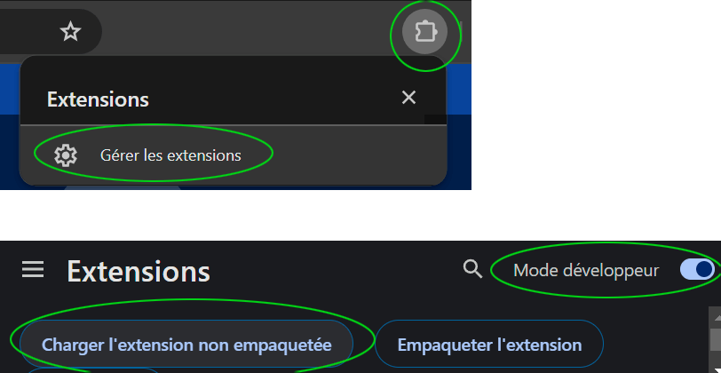
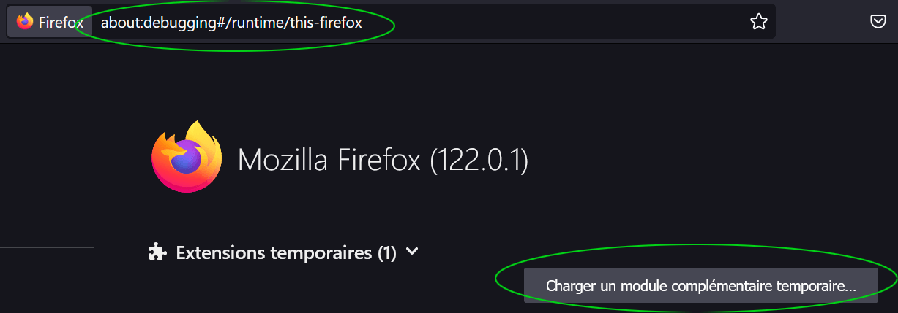

# INSTALLATION

## Prérequis

  - Node >= 18.0.0
  - Yarn

## Construction du projet

installer les dépendances :

```bash
yarn install
```

puis construire le projet :

```bash
yarn build
```

## Front

```bash
yarn dev
```

Les assets sont dans le dossier `styleguide/assets/`.

Les éléments du styleguide sont dans le dossier `styleguide/`.

## Génération de l'extension

### Pour Chrome

```bash
yarn buildChrome
```

### Pour Firefox

```bash
yarn buildFirefox
```

## Installation dans le navigateur

### Dans Chrome

  - Aller dans `chrome://extensions/`
  - Activer le mode développeur
  - Charger l'extension non empaquetée
  - Sélectionner le dossier `dist/chrome`



### Dans Firefox

  - Aller dans `about:debugging#/runtime/this-firefox`
  - Charger un module temporaire
  - Sélectionner le fichier `dist/firefox/manifest.json`



