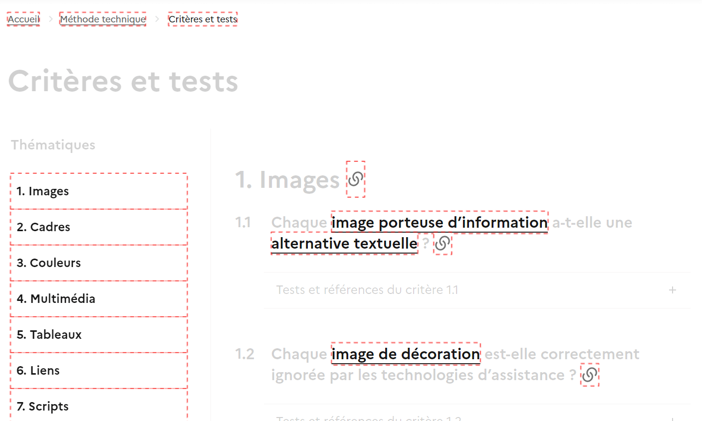
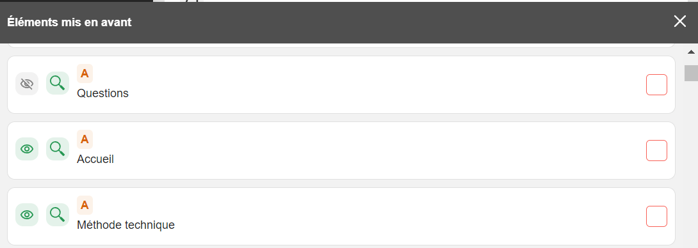
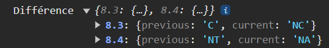
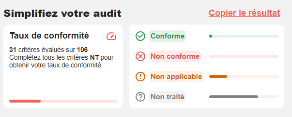
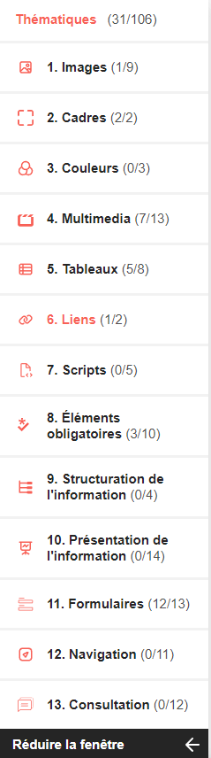

# MANUEL UTILISATEUR

## Accéder à l'extension

### Télécharger l'extension

L'extension est disponible:

- sur le [Chrome Web Store](https://chromewebstore.google.com/detail/rgaa-checker/eenibcgdpolkdophaaiikdcofgkjlllm?hl=fr) pour Chrome
- sur [Firefox Add-ons](https://addons.mozilla.org/fr/firefox/addon/rgaa-checker/) pour Firefox.

L'extension RGAA Checker s'intègre dans les outils de développement de votre navigateur, vous permettant ainsi d'effectuer des analyses conformes aux normes RGAA directement dans cet environnement spécialisé.

### Ouvrir l'extension sur chrome

1. Lancez Google Chrome sur votre ordinateur.
2. Accédez à une page Web que vous souhaitez analyser avec RGAA Checker.
3. Cliquez avec le bouton droit de la souris sur n'importe quel endroit de la page.
4. Sélectionnez "Inspecter" dans le menu contextuel. Cela ouvrira l'outil de développement de Chrome.
5. Dans la barre de navigation de l'outil de développement, recherchez l'onglet "RGAA Checker".
6. Cliquez sur cet onglet pour ouvrir l'extension RGAA Checker dans DevTools.

### Ouvrir l'extension sur Firefox

1. Lancez Mozilla Firefox sur votre ordinateur.
2. Accédez à une page Web que vous souhaitez analyser avec RGAA Checker.
3. Cliquez avec le bouton droit de la souris sur n'importe quel endroit de la page.
4. Sélectionnez "Inspecter l'élément" dans le menu contextuel. Cela ouvrira l'outil de développement de Firefox.
5. Dans la barre de navigation de l'outil de développement, recherchez l'onglet "RGAA Checker".
6. Cliquez sur cet onglet pour ouvrir l'extension RGAA Checker dans DevTools.

## Principe et fonctionnement

L'extension s'appuie sur la [liste des critères et tests fournis pour la DISIC](https://github.com/DISIC/RGAA/blob/master/v4.0/JSON/criteres.json).

Pour chaque critère pour lesquels c'est possible, le code permet de récupérer les éléments qui correspondent pour automatiser ou simplifier la vérification. Les sélecteurs sont plus poussés que ce qu'on fait habituellement à la main et permet de vérifier des éléments qui ne sont pas forcément visibles à l'oeil nu.

La validation des critères se fait sur l'état de la page au moment où l'extension est lancée. Cela signifie que si vous avez des éléments qui sont générés dynamiquement, il faudra les générer avant de lancer l'extension, ou la fermer et rouvrir pour actualiser les critères.

### Nomenclature

La nomenclature de l'état des critères a été reprise de celles des documents fournis par la DISIC. Les états possibles sont :

- **C** pour **Conforme** : le critère est validé automatiquement et répond à tous les tests
- **NC** pour **Non conforme** : le critère n'est pas conforme si au moins un élément de la page ne répond pas à un test
- **NA** pour **Non applicable** : aucun élément ne correpondant au critère n'a été trouvé dans la page
- **NT** pour **Non traité** : soit le critère doit être validé manuellement avec des indications, soit le critère n'a pas encore été implémenté ou ne peut pas être automatisé.

## Voir en détail les non-conformités

En cliquant sur **Voir les tests**, vous pouvez dérouler la liste des tests pour voir lesquels sont conformes ou non.

Pour voir plus en détail les éléments qui ne sont pas conformes, ils sont généralement indiqués dans la console, ce qui permet d'avoir une liste exhaustive et de les retrouver facilement dans la code source de la page.

## Calcul du taux de conformité

Le taux de conformité se base sur les [recommandations de la DINUM](https://accessibilite.numerique.gouv.fr/obligations/evaluation-conformite/).

Le pourcentage correspond au nombre de critères conformes par rapport au nombre total de critères applicables. `C / (C + NC) * 100`

L'indication en dessous du pourcentage indique le nombre de critères évalués par l'outil (`C + NC + NA`) par rapport au nombre total de critères total. **Le taux de conformité ne s'affiche qu'une fois tous les critères évalués**. Tant qu'il reste des critères en `NT`, le taux de conformité ne sera pas affiché.

## Mise en avant des éléments

Sur plusieurs critères vous trouverez un switch **Highlight**. En cliquant dessus, les éléments qui correspondent au critère sont mis en évidence dans la page, tandis que les éléments qui ne correspondent pas sont affichés avec une opacité réduite.

C'était important pour nous car on peut toujours voir le contexte des éléments dans la page tout en les retrouvant facilement. Et pour certains critères comme ceux de la thématique de structuration de l'information, ça permet d'aller plus loin que ce que l'on peut faire à la main. Au delà de voir si des titres ou des listes sont conformes etbien structurés, on peut également voir si par endroit on aurait dû avoir des listes ou des titres dans la sémantique mais qui ont été oubliés.

Les éléments mis en avant sont également affiché dans l'onglet. 2 options sont alors possibles :

- Voir l'élément dans la page, dans son contexte, si celui-ci est visible. (l'icone change si l'élément n'est pas visible)
- Voir l'élément dans le code source de la page, dans l'onglet _Elements_ des devtools. Ceci permet de voir les éléments qui ne sont pas visibles à l'oeil nu et de les retrouver facilement.

### Autres options de mise en avant

Parfois la mise en avant est remplacée par d'autres possibilités plus adpatées au critère. Par exemple désactiver les styles de la page pour vérifier la cohérence de la structure de la page quand les styles sont désactivés.

## Validation manuelle des critères

Pour certains critères la validation ne peut pas être automatisée. Dans ce cas nous essayons d'ajouter des indications pour faciliter la vérification manuelle. Ces critères restent dans un état **NT** pour **Non traité**. C'est le cas pour les tous les critèers qui demandent de vérifier la pertinence du contenu, comme par exemple la langue ou le titre de la page, l'intitulé des liens, etc.

Suite à votre vérification manuelle, vous pouvez changer l'état du critère en déroulant la liste et choisir l'état approprié.

## Sauvegarde des données

Les données sont sauvegardées dans le local storage du navigateur. Cela signifie que si vous changez de page ou que vous rafraîchissez la page, les données resteront en place. Cela permet de ne pas perdre le travail déjà effectué.

- Si vous changez manuellement un critère automatisé, votre valeur aura toujours l'ascendant sur la valeur automatisée.
- Les données sont stockées par rapport à l'url de la page, sans tenir compte des paramètres de l'url. Pour les sites en _one page_ ou les sites avec des paramètres dans l'url, cela signifie que les données seront les mêmes pour toutes les pages.

## Différences et évolutions entre chaque chargement

Si des critères évoluent entre deux chargements de la page, vous verrez une indication dans la console pour vous prévenir des différences.

Pour le moment l'affichage est sommaire, nous améliorerons cela dans une prochaine version.

## Export des données

Tout en haut de l'extension, vous avez un bouton **Copier le résultat**. Ca permet de stocker dans le presse papier la valeur des critères ainsi que les messages d'indications. Ce qui permet de remplir automatiquement [la grille d'audit RGAA fournie par l'Etat dans le kit d'audit](https://accessibilite.numerique.gouv.fr/ressources/kit-audit/).

Sur le fichier de la grille, il faut ensuite se placer dans l'onglet _P01_ (ou autre suivant la page correspondante) et de se placer dans la première cellule de la colonne **Critère** (cellule B4). Ensuite il suffit de coller le contenu du presse papier. Les données sont séparées par des tabulations, ce qui permet de coller directement dans le fichier.

Le fichier sera ainsi pré-rempli avec les données et messages d'indications.

## Filtres

Par défaut tous les critères son visibles, mais vous pouvez masquer ou afficher les critères en fonction de leur état. Cela permet de se concentrer sur les critères qui sont non conformes ou non traités par exemple.

## Autres fonctionnalités

### Paramètres

_À venir_

Nous aimerions ajouter des paramètres pour pouvoir personnaliser l'extension. Par exemple:

- paramétrer les couleurs utilisées pour la mise en avant des éléments et l'opacité des autres éléments.
- pouvoir exporter les données dans un autre format que le texte brut.
- les dimensions et la disposition de la fenêtre.

### Relancer les tests

Si vous souhaitez relancer les tests, vous pouvez cliquer sur le bouton **Relancer les tests** en haut à droite de l'extension. Cela permet de mettre à jour les critères en fonction des changements de la page entre deux moments.

Si vous chargez une nouvelle page, il faudra également relancer manuellement les tests pour que les critères soient mis à jour.

### Navigation dans les thématiques

La barre à gauche permet d'accéder directement à une thématique. Cela permet de ne pas avoir à scroller pour trouver un critère.

Si vous connaissez déjà bien les thématiques, vous pouvez également cliquer sur _Réduire la fenêtre_ pour n'afficher que les icônes des thématiques. Cela permet de gagner de la place dans la fenêtre.

